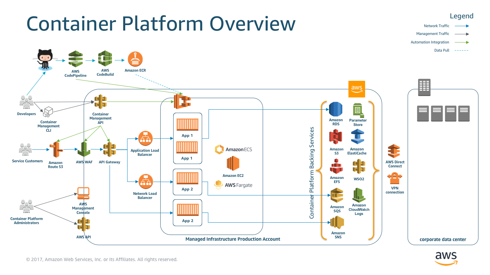

# Gureume Platform Template

This reference architecture provides a set of YAML templates for deploying a container cluster and supporting functionality to the Gureume Management API with [AWS CloudFormation](https://aws.amazon.com/cloudformation/).

## Overview



The architecture consists of two parts, the supporting platform and the management API.

This repository consists of a set of nested templates to deploy the supporting platform:

- A tiered [VPC](http://docs.aws.amazon.com/AmazonVPC/latest/UserGuide/VPC_Introduction.html) with public and private subnets, spanning an AWS region.
- A highly available ECS cluster deployed across two [Availability Zones](http://docs.aws.amazon.com/AWSEC2/latest/UserGuide/using-regions-availability-zones.html) in an [Auto Scaling](https://aws.amazon.com/autoscaling/) group and that are AWS SSM enabled.
- A pair of [NAT gateways](http://docs.aws.amazon.com/AmazonVPC/latest/UserGuide/vpc-nat-gateway.html) (one in each zone) to handle outbound traffic.
- An [Application Load Balancer (ALB)](https://aws.amazon.com/elasticloadbalancing/applicationloadbalancer/) to the public subnets to handle inbound traffic.
- ALB path-based routes for each ECS service to route the inbound traffic to the correct service.
- Centralized container logging with [Amazon CloudWatch Logs](http://docs.aws.amazon.com/AmazonCloudWatch/latest/logs/WhatIsCloudWatchLogs.html).
- A [Lambda Function](https://docs.aws.amazon.com/lambda/latest/dg/welcome.html) and [Auto Scaling Lifecycle Hook](https://docs.aws.amazon.com/autoscaling/ec2/userguide/lifecycle-hooks.html) to [drain Tasks from your Container Instances](https://docs.aws.amazon.com/AmazonECS/latest/developerguide/container-instance-draining.html) when an Instance is selected for Termination in your Auto Scaling Group.

## Template details

The templates below are included in this repository and reference architecture:

| Template | Description |
| --- | --- |
| [master.yaml](master.yaml) | This is the master template - deploy it to CloudFormation and it includes all of the others automatically. |
| [infrastructure/vpc.yaml](infrastructure/vpc.yaml) | This template deploys a VPC with a pair of public and private subnets spread across two Availability Zones. It deploys an [Internet gateway](http://docs.aws.amazon.com/AmazonVPC/latest/UserGuide/VPC_Internet_Gateway.html), with a default route on the public subnets. It deploys a pair of NAT gateways (one in each zone), and default routes for them in the private subnets. |
| [infrastructure/load-balancers.yaml](infrastructure/load-balancers.yaml) | This template deploys an ALB to the public subnets, which exposes the various ECS services. It is created in in a separate nested template, so that it can be referenced by all of the other nested templates and so that the various ECS services can register with it. |
| [infrastructure/ecs-cluster.yaml](infrastructure/ecs-cluster.yaml) | This template deploys an ECS cluster to the private subnets using an Auto Scaling group and installs the AWS SSM agent with related policy requirements. |
| [infrastructure/lifecyclehook.yaml](infrastructure/lifecyclehook.yaml) | This template deploys a Lambda Function and Auto Scaling Lifecycle Hook to drain Tasks from your Container Instances when an Instance is selected for Termination in your Auto Scaling Group.

After the CloudFormation templates have been deployed, the [stack outputs](http://docs.aws.amazon.com/AWSCloudFormation/latest/UserGuide/outputs-section-structure.html) contain a

The ECS instances should also appear in the Managed Instances section of the EC2 console.

## Deployment Instructions

### Prerequisites

#### ECS Service Discovery

Since [ECS Service Discovery](https://docs.aws.amazon.com/AmazonECS/latest/developerguide/service-discovery.html#create-service-discovery) isn't available through CloudFormation yet we'll need to setup this manually before.

1. Create a new service discovery namespace for our cluster

    ``` bash
    aws servicediscovery create-private-dns-namespace --name PLATFORM_NAME --vpc vpc-abcd1234 --region us-east-1
    ```

2. Using the OperationId from the previous output, verify that the private namespace was created successfully.

    ``` bash
    aws servicediscovery get-operation --operation-id h2qe3s6dxftvvt7riu6lfy2f6c3jlhf4-je6chs2e
    ```

### Setup centralized container logging

By default, the containers in your ECS tasks/services are already configured to send log information to CloudWatch Logs and retain them for 365 days. Within each service's template (in [cfn/app/*](cfn/app/)), a LogGroup is created that is named after the CloudFormation stack. All container logs are sent to that CloudWatch Logs log group.

You can view the logs by looking in your [CloudWatch Logs console](https://console.aws.amazon.com/cloudwatch/home?#logs:) (make sure you are in the correct AWS region).

ECS also supports other logging drivers, including `syslog`, `journald`, `splunk`, `gelf`, `json-file`, and `fluentd`. To configure those instead, adjust the service template to use the alternative `LogDriver`. You can also adjust the log retention period from the default 365 days by tweaking the `RetentionInDays` parameter.

For more information, see the [LogConfiguration](http://docs.aws.amazon.com/AmazonECS/latest/APIReference/API_LogConfiguration.html) API operation.

> Note: Changing the log driver means that you will need to handle authorization to log groups outside of the container platform. (or simply accept that users can view each others logs)

### Change the ECS host instance type

> Note: This only applies if you are not deploying using ECS Fargate

This is specified in the [template.yaml](template.yaml) template.

By default, [t2.large](https://aws.amazon.com/ec2/instance-types/) instances are used, but you can change this by modifying the following section:

``` YAML
ECS:
  Type: AWS::CloudFormation::Stack
    Properties:
      TemplateURL: ...
      Parameters:
        ...
        InstanceType: t2.large
        InstanceCount: 4
        ...
```

### Adjust the Auto Scaling parameters for ECS hosts and services

> Note: This only applies if you are not deploying using ECS Fargate

The Auto Scaling group scaling policy provided by default launches and maintains a cluster of 4 ECS hosts distributed across two Availability Zones (min: 4, max: 4, desired: 4).

It is ***not*** set up to scale automatically based on any policies (CPU, network, time of day, etc.).

If you would like to configure policy or time-based automatic scaling, you can add the [ScalingPolicy](http://docs.aws.amazon.com/AWSCloudFormation/latest/UserGuide/aws-properties-as-policy.html) property to the AutoScalingGroup deployed in [infrastructure/ecs-cluster.yaml](infrastructure/ecs-cluster.yaml#L69).

As well as configuring Auto Scaling for the ECS hosts (your pool of compute), you can also configure scaling each individual ECS service. This can be useful if you want to run more instances of each container/task depending on the load or time of day (or a custom CloudWatch metric). To do this, you need to create [AWS::ApplicationAutoScaling::ScalingPolicy](http://docs.aws.amazon.com/pt_br/AWSCloudFormation/latest/UserGuide/aws-resource-applicationautoscaling-scalingpolicy.html) within your service template.

### Deploy multiple environments (e.g., dev, test, pre-production)

Deploy another CloudFormation stack from the same set of templates to create a new environment. The stack name provided when deploying the stack is prefixed to all taggable resources (e.g., EC2 instances, VPCs, etc.) so you can distinguish the different environment resources in the AWS Management Console.

### Change the VPC or subnet IP ranges

This set of templates deploys the following network design:

| Item | CIDR Range | Usable IPs | Description |
| --- | --- | --- | --- |
| VPC | 10.180.0.0/16 | 65,536 | The whole range used for the VPC and all subnets |
| Public Subnet | 10.180.8.0/21 | 2,041 | The public subnet in the first Availability Zone |
| Public Subnet | 10.180.16.0/21 | 2,041 | The public subnet in the second Availability Zone |
| Private Subnet | 10.180.24.0/21 | 2,041 | The private subnet in the first Availability Zone |
| Private Subnet | 10.180.32.0/21 | 2,041 | The private subnet in the second Availability Zone |

You can adjust the CIDR ranges used in this section of the [master.yaml](master.yaml) template:

``` YAML
VPC:
  Type: AWS::CloudFormation::Stack
    Properties:
      TemplateURL: !Sub ${TemplateLocation}/infrastructure/vpc.yaml
      Parameters:
        EnvironmentName:    !Ref AWS::StackName
        VpcCIDR:            10.180.0.0/16
        PublicSubnet1CIDR:  10.180.8.0/21
        PublicSubnet2CIDR:  10.180.16.0/21
        PrivateSubnet1CIDR: 10.180.24.0/21
        PrivateSubnet2CIDR: 10.180.32.0/21
```

### Update an ECS service to a new Docker image version

The platform users handle the definition of the container image they want to use, howver you can override certain properties in the app.yaml files being deployed by the platform.

To adjust the rollout parameters (min/max number of tasks/containers to keep in service at any time), you need to configure `DeploymentConfiguration` for the ECS service.

For example:

``` YAML
Service:
  Type: AWS::ECS::Service
    Properties:
      ...
      DesiredCount: 4
      DeploymentConfiguration:
        MaximumPercent: 200
        MinimumHealthyPercent: 50
```

### Use the SSM Run Command function to see details in the ECS instances

The AWS SSM Run Command function, in the EC2 console, can be used to execute commands at the shell on the ECS instances. These can be helpful for examining the installed configuration of the instances without requiring direct access to them.

### Spot Instances and the Hibernate Agent

In order to use Spot with this template, you will need to enable ```SpotPrice``` under the ```AWS::AutoScaling::LaunchConfiguration``` or add in ```AWS::EC2::SpotFleet``` support.  To fully use Hibernation with Spot instances, please review [Spot Instance Interruptions](https://docs.aws.amazon.com/AWSEC2/latest/UserGuide/spot-interruptions.html).